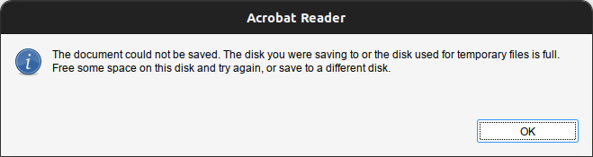
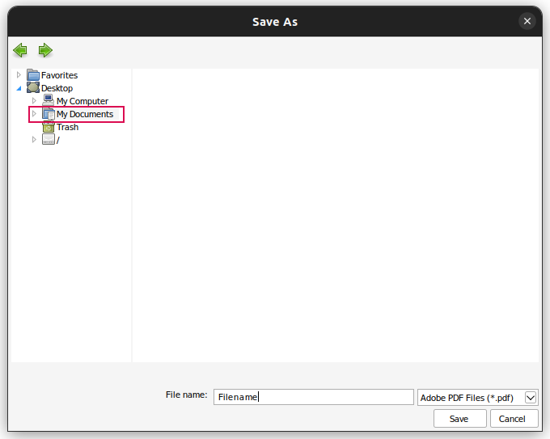

+++
title='Acrobat Reader'
date = 2022-09-30
updated = 2023-11-08
extra = { series = "debian" }
taxonomies = { tags = ["debian"] }
+++

# Saving Issues

Sometimes when you try to save a file you get an error saying:

> The document could not be saved. The disk you were saving to or the disk used for temporary files is full.
> Free some space on the disk and try again, or save to a different disk.



It will then open the save as dialog. Save to my documents.



File will be able to be found in the `Documents` folder in your home folder.
It actually goes to `/home/one/snap/acrordrdc/common/.wine/drive_c/users/one/My Documents/` but that is appears to be
symlinked to your Documents folder.

# Printing

Source: <https://forum.snapcraft.io/t/solved-acrordrdc-adobe-acrobat-reader-wine-no-printer/19110/2>

If no printers show up, or you get an error saying to install printers, then use the following commands to enable them
in this snap

```sh
snap connect acrordrdc:removable-media
snap connect acrordrdc:cups-control
```
