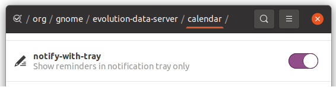

+++
title="Calender Notifications Popup Disable"
date = 2022-08-19
updated = 2023-11-08
+++

Source: <https://newbedev.com/turn-off-calendar-notifications-ubuntu-20-04>

### Install dconf Editor

```sh
sudo apt install dconf-editor
```

### Launch dconf Editor


### Change setting

Navigate to `/org/gnome/evolution-data-server/calendar` and set `notify-with-tray` to "on".



---