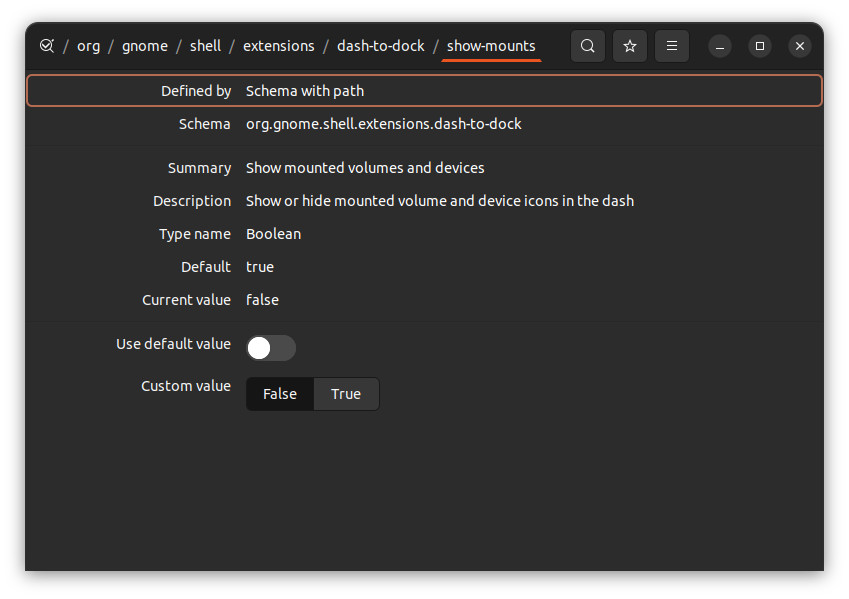

+++
title="Hide Mounts"
date = 2022-08-19
updated = 2025-04-15
extra = { series = "debian" }
taxonomies = { tags = ["debian"] }
+++

Source: <https://askubuntu.com/questions/1263625/remove-hdd-icon-from-dock-in-20-04>

To remove mounts from always showing on dock use dconf see screenshot.

Search Terms: Remove HDD from dock
