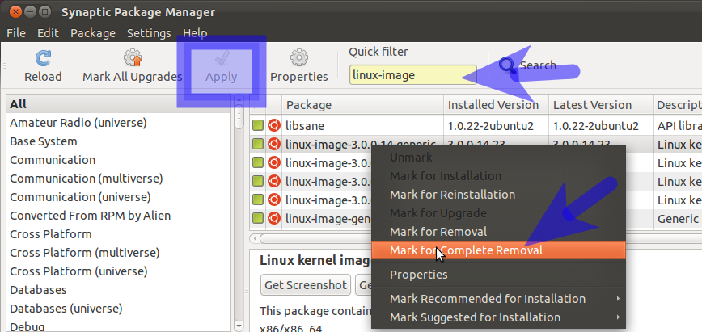

+++
title="Manually Removing Old Kernels"
date = 2023-03-30
updated = 2025-04-15
extra = { series = "debian" }
taxonomies = { tags = ["debian"] }
+++

# TLDR

[Check current](@/debian/manual_kernel_remove/index.md#check-current-kernel-version-in-use) to know which not to remove. `uname -r`

[Search keys](@/debian/manual_kernel_remove/index.md#mark-kernels-for-removal) to remove the backup kernel manually

- `linux-image`
- `linux-header`

# Background

My `/boot` partition is 1GB because that seemed like plenty enough space but turns out well it's not. When there is a new kernel sometimes I'll need to manually remove the old one to make space for the new one. This isn't the biggest of problems in the world but it's less than desirable. From my understanding in addition to the currently running kernel one older kernel is kept as a backup but seems I only have space for 2 so when a new one comes out I need to remove the old one.

# Using Synaptic

Source: <https://askubuntu.com/questions/2793/how-do-i-remove-old-kernel-versions-to-clean-up-the-boot-menu>

## WARNING!!!

If you remove your current kernel then you won't be able to boot.

## Install Synaptic

I typically install it from the Ubuntu Store and it comes preinstalled on Debian. In the Ubuntu store it is listed as "Synaptic Package Manager". Or it can be installed with the following command

```sh
sudo apt install synaptic
```

## Check current kernel version in use

Use the following command to check your current kernel version in use and ensure you do NOT remove this version.

```sh
uname -r
```

## Mark kernels for removal

Search for the following search terms and remove the kernels that you want to remove.

- `linux-image`
- `linux-header`


