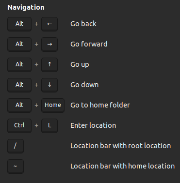

+++
title='Nautilus'
date = 2022-08-19
updated = 2023-11-08
+++

Many useful shortcuts for Nautilus can be found in the menu under shortcuts,
but I highlight my more frequently used ones here.

Shortcuts can also be accessed using `Ctrl + ?` (Requires you to press `Ctrl + Shift + ?` on most keyboards as ? is a
key that requires shift)

- Navigate to folder using path on clipboard `Ctrl + L` (see three options at bottom)

