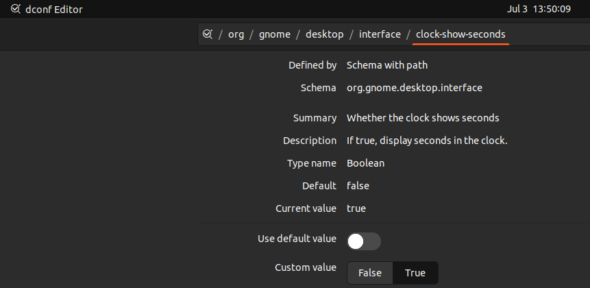

+++
title="Show Seconds on Clock Display"
date = 2023-07-03
updated = 2025-04-15
extra = { series = "debian" }
taxonomies = { tags = ["debian"] }
+++

1. Open `dconf Editor` (May need to be installed, not included by default)
2. See screenshot for option to toggle. NB: Screenshot includes the clock in the center at the top of the screen with the seconds on.

