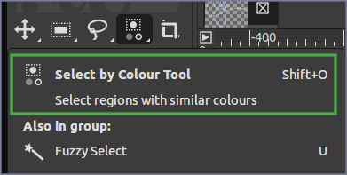

+++
title="Transparent background"
date = 2023-06-05
updated = 2025-10-09
extra = { series = "GIMP" }
taxonomies = { tags = ["GIMP"] }
+++

Source: <https://youtu.be/nl2uqKqbryo>

1. Right click the channel on the right and click `Add alpha channel`
2. Select the area (**See note below**)
3. Press Delete
4. Save in supported format like png

**How to do selection**

If the background is not contiguous but is the same color it goes **A LOT** faster to use `Select by Colour Tool` instead of `Fuzzy Select`.

---

NB: There is an alternative approach with manual selection of parts to be removed that can be found here <https://youtu.be/C0tg2mRroSY>
