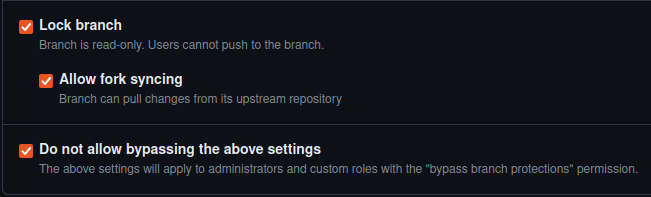

+++
title = "Forking"
date = 2024-02-22
extra = { series = "github" }
taxonomies = { tags = ["github"] }
updated = 2025-04-15
+++

If forking a repo to make a PR and you intend to keep fork around then it's advisable not to commit to the main branch to avoid issues with history not being able to be linear.
I normally set branch protection on the main branch as shown in the screenshot.
This still allows it to be updated from the upstream but not committed to directly.\

Note: If `Do not allow bypassing the above settings` is not checked it is still very easy to accidentally commit to main.
