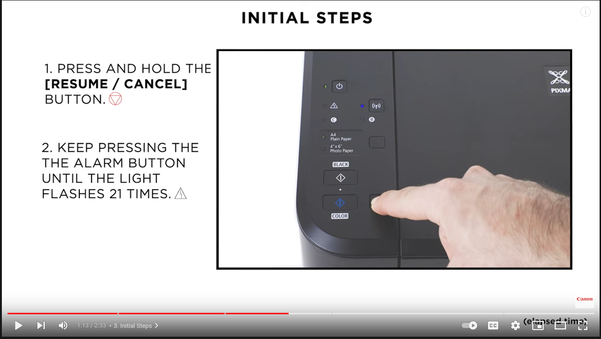
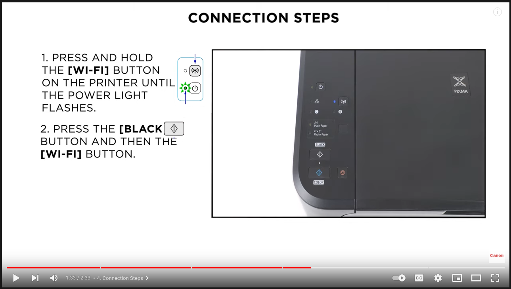
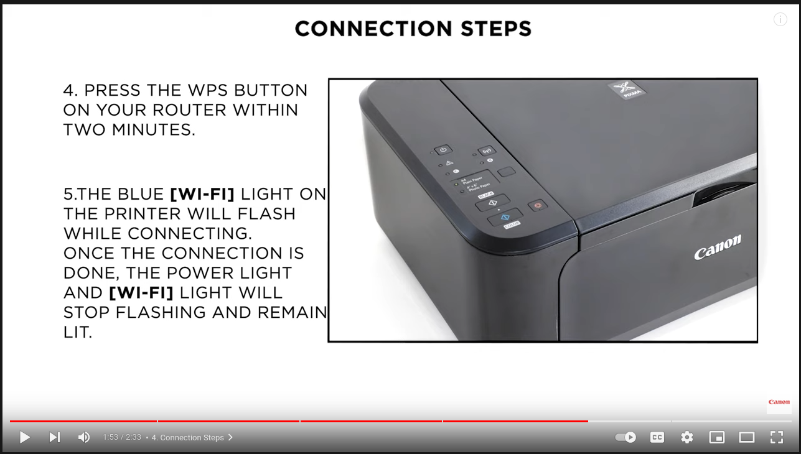

+++
title = "Cannon MG3600"
date = 2022-06-01
updated = 2024-12-16
extra = { series = "misc" }
taxonomies = { tags = ["misc"] }
+++

# Connecting the printer to the WiFi using WPS

Source: [Cannon Europe Support Video on YouTube](https://www.youtube.com/watch?v=TWZ-tDtonYI) and [Cannon Canada Support Page][support_article]

## Foreword

Before you can connect to Wi-Fi the current settings must be reset (see [reset instructions](#wifi-reset)).
These instructions are for "Connecting Printer and Wireless Router Using WPS Push Button - PIXMA MG3620"

## WiFi Reset

- Press and hold the [Resume / Cancel] Button until the alarm button flashes 21 times\
  
- At this point the power light should be flashing. (Not sure what needs to happen next, my suggestion to my future self is just wait for it to stop and see if that works)

## Steps to Connect to New Wi-Fi

NB: The instructions from the [support article][support_article] for this part are ok **AS LONG AS YOU ALREADY DID THE RESET**.

1. Be ready to press the WPS button on your router or press it from the web interface of the router from a nearby device.
1. Press and hold the **WI-FI Button** on the printer until the power light flashes once.
1. Press the **Black Button**
1. Press the **Wi-Fi Button** again the Wi-Fi light will start to flash (see example of flashing in [their instructions][support_article])\
   
1. Press and hold the WPS button on the router within two minutes
1. Complete when the power light and the Wi-Fi light stop flashing\
   

[support_article]: https://canoncanada.custhelp.com/app/answers/answer_view/a_id/1036193/session/L2F2LzEvdGltZS8xNzM0Mzc3Mzg4L2dlbi8xNzM0Mzc3Mzg4L3NpZC9mVWNkT0ZiVzUlN0VtaWxhb3NSbnJXczFxQ0ozOEpzdlVoMHJJbktRQXl5aXdGV0dYWERwV1oya29aVkU4dzdQcFZ1YkZWX0dLJTdFYl9ocVN1dmxRUGN5Slc5MkpNTUxoN1lEZjFsRDdXUjZDNEE5MzVqbFFsQUVGUTdnJTIxJTIx
