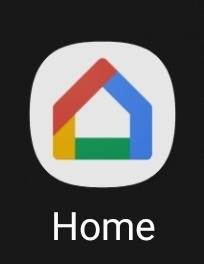
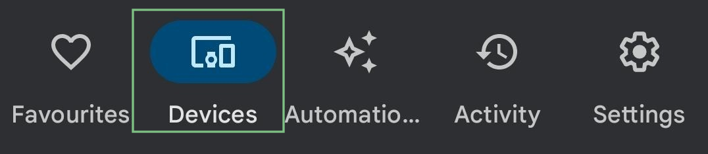
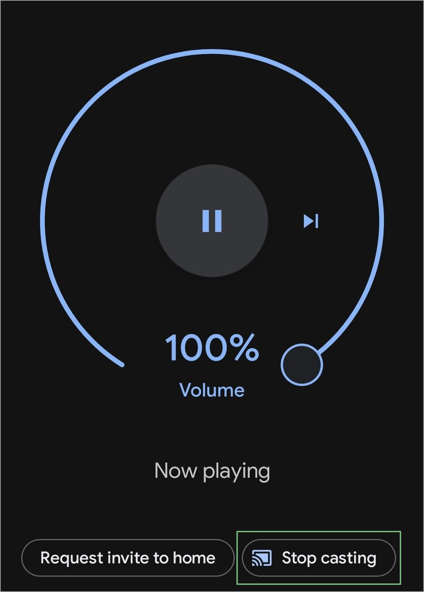
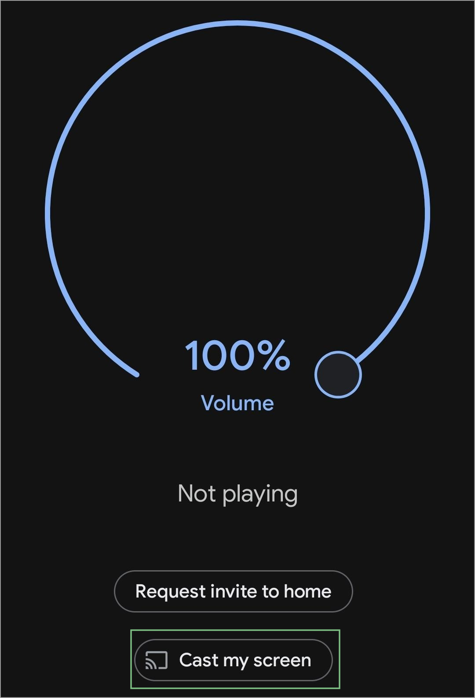

+++
title = "Chromecast"
date = 2023-12-27
extra = { series = "misc" }
taxonomies = { tags = ["misc"] }
+++

# Mirror Phone Screen

NB: I only have one Chromecast so instructions my vary a bit with more than one device.

**Observations**

- Video freezes after a short while of watching YouTube
- Video doesn't play if watching Prime Video (Captions and settings screens show)
- Audio continues to work when video freezes

## Instructions

- Open Google Home\
  
- Go to devices\
  
- Select applicable device
- Stop current casting if needed (Includes content playing on device)\
  
- Select device
- Mirror my screen\
  
