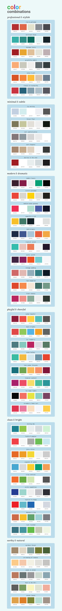

+++
title = "Colors"
date = 2024-07-28
taxonomies = { tags = ["misc"] }
updated = 2025-04-25
+++

# Color Blindness

When choosing colors it's always good to bear accessibility in mind.
One of the best explanations of color blindness that I've come across is the one on [venngage.com](https://venngage.com/blog/color-blind-friendly-palette/).
I've found the following color palette from their site to be very useful:

