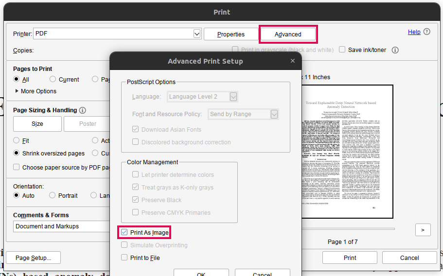
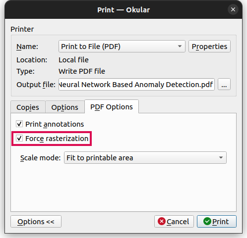

+++
title='PDF Garbled (Fix)'
date = 2022-08-19
updated = 2025-04-15
extra = { series = "misc" }
taxonomies = { tags = ["misc"] }
+++

# Background

Got a PDF that would display on the screen fine for reading but would produce garbled text when trying to copy and
paste.
Main motivation for addressing the issue is to be able to use text to speech on the pdf to read it.
This page is meant to document the options found to address this issue.

# Convert pdf to images instead of garbled text

Two methods were found for this with varied pros and cons

## Use Acrobat Reader to convert

- Pros: Produced smaller file (On example pdf was by a factor of 2)
- Cons: Took a bit more effort

1. Open the file in Acrobat Reader
2. Ctrl + P to print
3. Go to Advanced
4. Check `Print As Image`

## Use Okular to convert

- Pros: Faster to do with somewhat less effort especially as it is the default app to open PDFs
- Cons: Produce a larger file (On example pdf was by a factor of 2)

1. Open file in Okular
2. Ctrl + P to print
3. Expand Options at the bottom
4. `PDF Options` tab
5. Check `Force rasterization`

# OCR the image PDF

## Use [@Voice Aloud Reader](https://play.google.com/store/apps/details?id=com.hyperionics.avar)

- Pros: Directly does text to speech once completed
- Cons:
  - Must plug into to charger to do multiple pages
  - Must use mobile device
  - Not easily able to copy and paste

## Use online service

Online service: <https://www.sejda.com/ocr-pdf>

- Pros: Gives you a new version of the PDF you can use on any device
- Cons: Not local program (Small amounts free)
