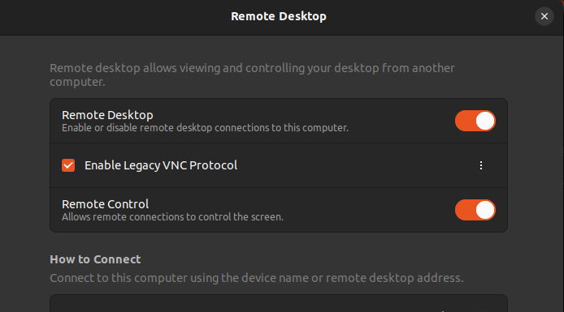
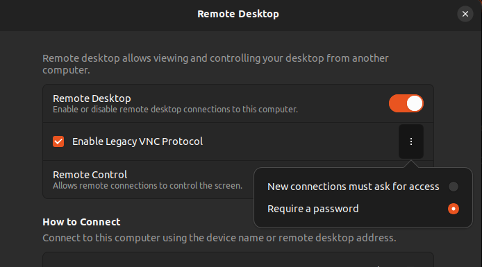
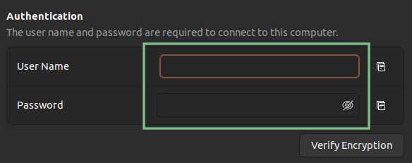
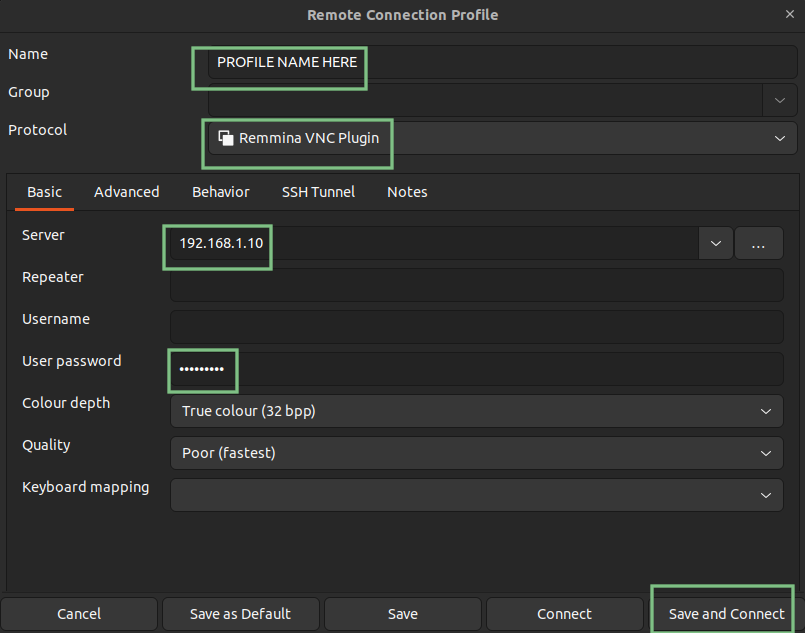

+++
title = "VNC Ubuntu"
date = 2024-01-07
+++

I've needed to do this three times now and each time I don't know what happens but I get issues so writing it down this time.
The last time I think I got RDP working but I can't figure out what's wrong this time.

The [official docs](https://help.ubuntu.com/stable/ubuntu-help/sharing-desktop.html.ro) may work for you but I didn't get through.
Linking here as I usually end up looking at them.

**Use Case**: Simple remote screen sharing on local network.
Screen stays visible on host computer and client is also able to view and interact.
This is **NOT** suitable for use on a network that is not private but is good enough for my use case on my local network.

**OS Tested on**: Ubuntu 22.04 (Both sides) (I also have an older version of Ubuntu that I connect to, but don't remember what I did on that one and the UI is different).

# Setup Host (Side to connect to)

- Go to Settings -> Sharing
- Move the slider at the top to the right to enable

## Instructions by picture

## In Text

- Go to Remote Desktop
- Enable `Remote Desktop`
- Check `Enable Legacy VNC Protocol`
- Enable `Remote Control` (If you want to do more than view only)
- Optional - You may want to no require the user to be at the machine to approve access
  - Click the three dots next to `Enable Legacy VNC Protocol`
  - Select `Require a password`
- Set username and password, under `Authentication` at the bottom (username doesn't get used but I put it in anyway as I think it might be used for RDP)
- Check your [IP](@/debian/useful_commands.md#show-ip-addresses) (You may want to set a reserved IP in your router if you plan to do this often)

# Setup Client (Side to connect from)

These instructions use **Remmina** because it comes installed with the distro.

- Set `Name` to any name you want it is only for you to identify the profile
- Change the protocol to `Remmina VNC Plugin`
- Set `Server` to the IP of the Host computer
- Leave `Username` **blank**
- Set the `User Password` to the password set on the host (IF THIS IS WRONG IT DOESN'T TELL YOU WRONG PASSWORD, IT JUST WON'T WORK SO DOUBLE CHECK THE PASSWORD)
