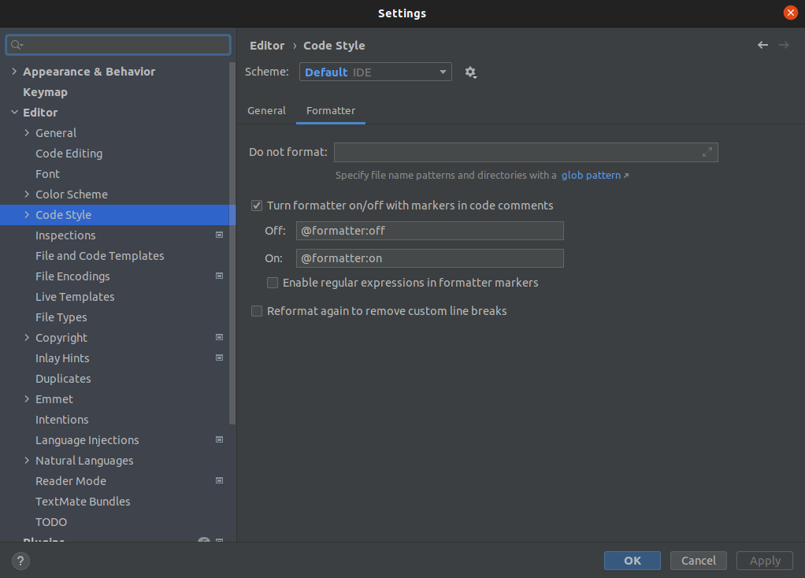

+++
title="Disable Formatter on parts of Code"
date = 2022-08-19
updated = 2025-04-15
extra = { series = "pycharm" }
taxonomies = { tags = ["pycharm"] }
+++

Source: <https://stackoverflow.com/questions/14020200/how-to-config-intellij-idea-not-format-some-part-of-the-code>

## How to use

```python
# @formatter:off
...
# @formatter:on
```

## Required Settings

Ensure it is enabled in settings

Search String: "formatter markers"

Editor -> Code Style: Formatter : Turn formatter on/off with markers in code comments


