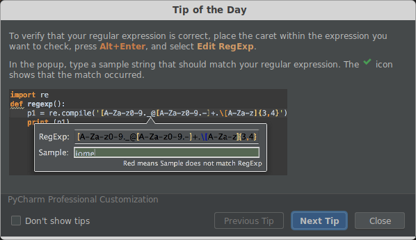

+++
title="RegExp Editor"
date = 2022-08-19
updated = 2025-04-26
extra = { series = "PyCharm" }
taxonomies = { tags = ["PyCharm"] }
+++

Also see my page on [regex](@/misc/regex.md) where I have a cookbook of regexes I wrote or found and think I may use again.
