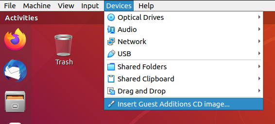

+++
title="Guest Additions"
date = 2022-10-19
updated = 2023-11-08
+++

Steps recorded on VM running Ubuntu 18.04.6

# Features observed missing without install

- Copy and paste in both directions not working
- Drag and drop in both directions not working (From guest to Host still not working after)
- Resolution resize with window size

# Install Steps

Use the menu and Click on `Insert Guest Additions CD Image...` from `Devices`



Navigate to the mounted image in terminal (Can use GUI then right click and `Open in Terminal`) then issue the following
commands

```sh
sudo apt install build-essential
sudo ./VBoxLinuxAdditions.run
```

Then just **restart** to complete the installation. (Remember to enabled copy and paste from sub menu under `Devices`).

**NB: Drag and drop worked fine from Host to Guest but from Guest to Host would cause the application I was dragging
from to freeze.**
