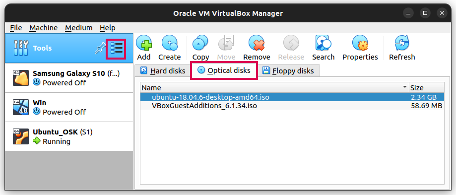

+++
title="Optical Disks Management"
date = 2022-08-19
updated = 2023-11-08
extra = { series = "virtual_box" }
taxonomies = { tags = ["virtual_box"] }
+++

Optical disks can be managed by:

1. Clicking on the menu button next to `Tools`
2. Then clicking media (not shown in screenshot)
3. Then the `Optical disks` tab
   1. Then remove and other useful options become available
   2. As well as properties which can be used to see where the iso is expected to be
