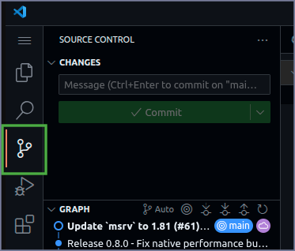
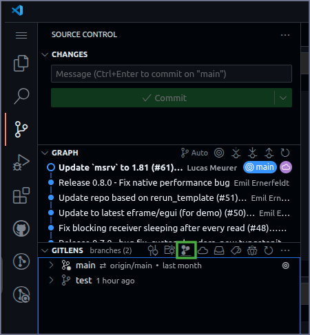
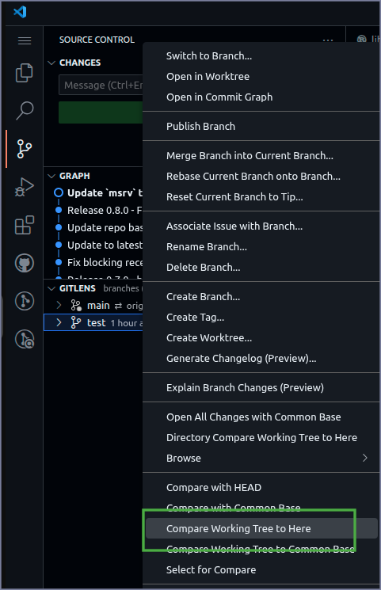
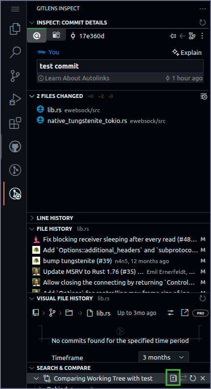

+++
title="GitLens"
date = 2025-05-24
extra = { series = "VSCode" }
taxonomies = { tags = ["VSCode"] }
+++

# Easily pull in changes from another branch

**WARNING:**: Depending on your use case using merging branches or [git cherry picking](https://www.atlassian.com/git/tutorials/cherry-pick) might make more sense but if the branches will never be merged and you don't want to take entire commits or want to selectively pick from just the current diff between the branches then this might make sense.

- Source Control\
  
- GITLENS Branches Tab\
  
- Right click on a branch then click `Compare Working Tree to Here`\
  
- Click `Open All Changes`\
  
